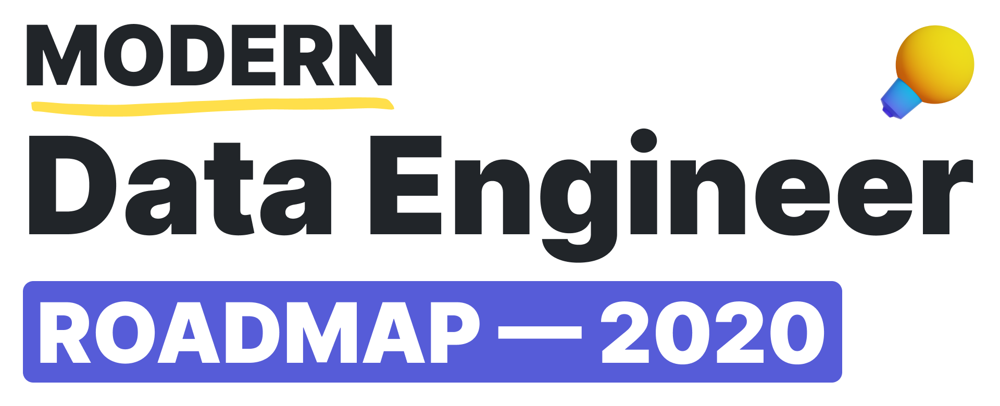
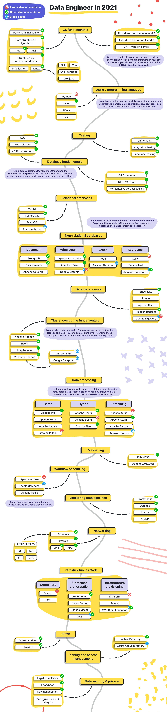
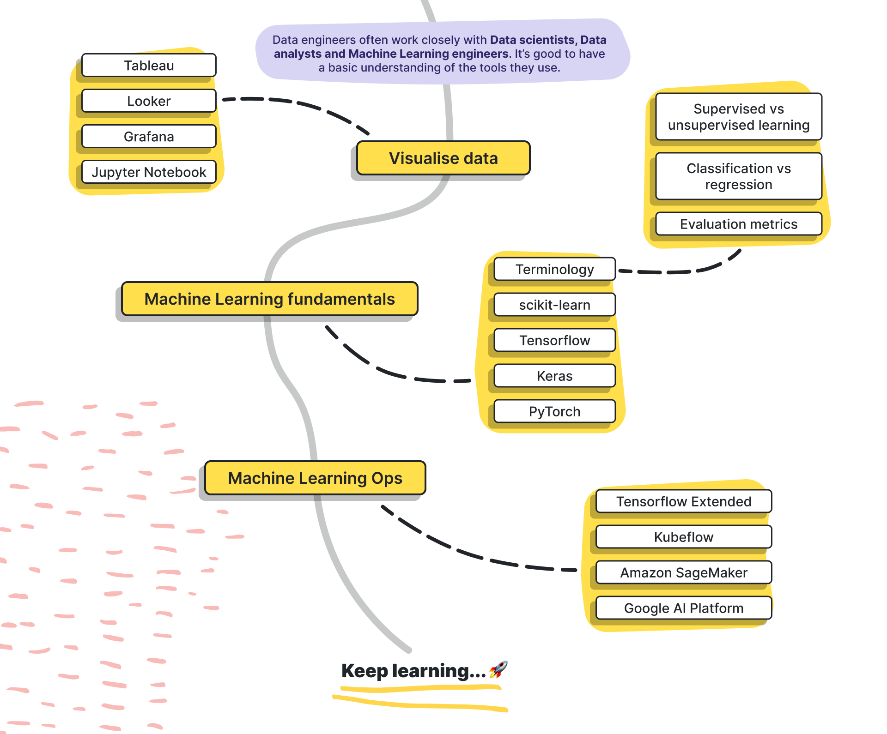

> Roadmap to becoming a data engineer in 2021

This roadmap aims to give a **complete picture of the modern data engineering landscape** and serve as a **study guide** for aspiring data engineers.

***

<h3 align="center"><strong>Note to beginners</strong></h3>

> Beginners shouldn’t feel overwhelmed by the vast number of tools and frameworks listed here. A typical data engineer would master a subset of these tools throughout several years depending on his/her company and career choices.

***

🔥  We just launched [**Data Stack Jobs**](https://datastackjobs.com/) — a clean and simple job site for Data Stack Engineers!

> [Text version for visually impaired users](text/roadmap.md)

## Nice to have 😎

> [Text version for visually impaired users](text/extras.md)

## Contributions are welcome 💜

Please raise an issue to discuss your suggestions or open a Pull Request to request improvements.

## Reviewers 🔎

Huge thank you to [@whydidithavetobebugs](https://github.com/whydidithavetobebugs), [@sawidis](https://github.com/sawidis), [@marclamberti](https://github.com/marclamberti) and [@mpyeager](https://github.com/mpyeager) for reviewing this roadmap.

## About us 👋🏼

[datastack.tv](https://datastack.tv/) is the learning platform for the modern data stack. We create concise screencast video tutorials for data engineers. [**Browse our courses here!**](https://datastack.tv/courses.html)

## License 🗞

> Copyright © 2021 Alexandra Abbas — <hello@datastack.tv>
